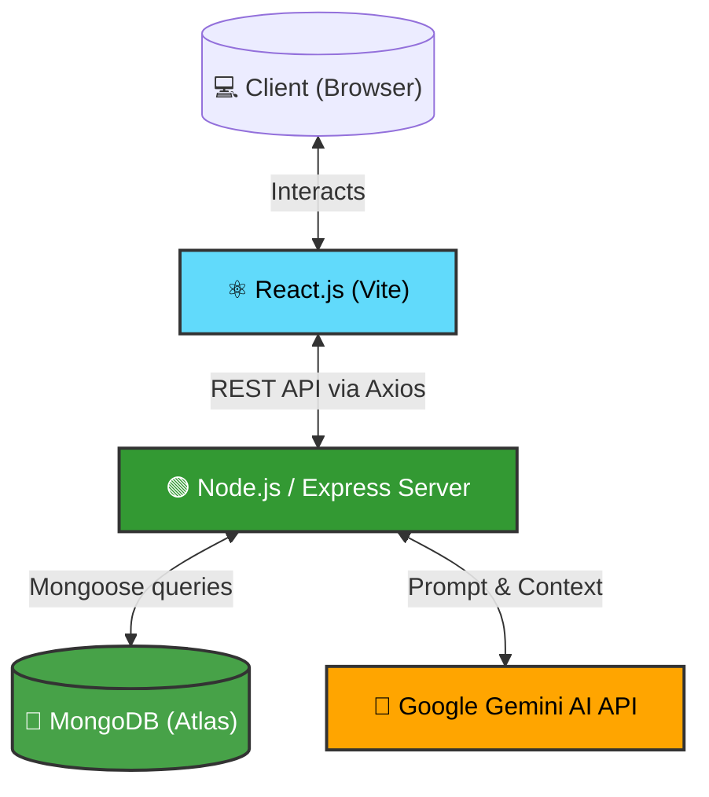
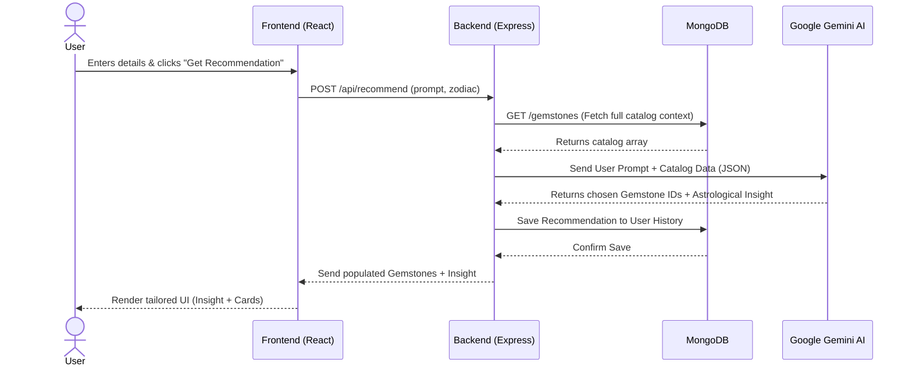

# 💎 Lumina Gemstones - AI-Powered Astrological Application


A premium, full-stack web application designed for astrological gemstone discovery. The application features a stunning UI built with Tailwind CSS and an intelligent recommendation engine powered by **Google Gemini AI**.

---

## ✨ Core Features

1. **AI Recommendation Engine**: 
   - Uses Google's Gemini Flash AI to act as a virtual astrologer.
   - Users can input their Zodiac sign, Date of Birth, or specific life goals (e.g., "I need better focus and wealth").
   - The AI processes the query and maps it directly to the database of available gemstones, returning a personalized astrological insight alongside the recommended physical stones.
2. **Curated Gemstone Catalog**: 
   - A beautifully designed browsing experience for 15 authentic astrological gemstones.
   - Includes high-quality, locally hosted imagery (no broken links).
   - Filterable by Zodiac sign.
3. **Personalized User Dashboard**: 
   - Full JWT-based authentication system.
   - Users can edit their profile and manually override their Zodiac sign.
   - Tracks a history of all past AI consultations.
   - Allows users to maintain a "Watchlist" and view simulated "Purchases".

---

## 🏗️ System Architecture



---

## 📂 Folder Structure

The project follows a standard MERN monorepo structure.

```text
gemstone-app/
├── client/                     # ⚛️ React Frontend (Vite)
│   ├── public/
│   │   └── images/             # Locally hosted, high-res gemstone images
│   ├── src/
│   │   ├── components/         # Reusable UI components (Navbar, Footer, Forms)
│   │   ├── pages/              # Route views (Home, Catalog, Dashboard, Recommend)
│   │   ├── store/              # Global state management using Zustand
│   │   ├── index.css           # Tailwind CSS tokens and global styles
│   │   ├── main.jsx            # React DOM injection
│   │   └── App.jsx             # React Router configuration
│   ├── package.json
│   └── tailwind.config.js      # Custom theme, colors, and fonts
│
├── server/                     # 🟢 Node.js + Express Backend
│   ├── data/
│   │   └── seed.js             # Script to initialize MongoDB with the 15 gemstones
│   ├── middleware/
│   │   └── auth.js             # JWT verification middleware for protected routes
│   ├── models/                 # Mongoose Schemas
│   │   ├── Gemstone.js         # Gemstone data schema
│   │   └── User.js             # User data, watchlists, and AI history schema
│   ├── routes/                 # Express API Endpoints
│   │   ├── api.js              # Public routes (fetch catalog, Gemini AI logic)
│   │   └── auth.js             # Protected routes (login, register, profile update)
│   ├── .env.example            # Environment variables template
│   ├── server.js               # Express server entry point
│   └── package.json
│
├── package.json                # 📦 Root package.json (handles concurrent execution)
└── README.md                   # Project documentation
```

---

## 🔄 Application Flow

### Gemini AI Recommendation Flow



1. **Authentication & Profile**: A user registers an account. Their Zodiac sign is automatically calculated from their Date of Birth (though they can override it in the Settings tab of their Dashboard).
2. **Browsing**: The user navigates to the Catalog. The React frontend (`pages/Catalog.jsx`) makes an Axios GET request to `server/routes/api.js`, which fetches all gemstones from MongoDB.
3. **AI Consultation**: The user navigates to the Recommendation Engine. They submit a prompt.
   - The React app sends the prompt, alongside the user's Zodiac sign, to the backend.
   - The Node.js backend initializes the `@google/genai` client, injecting all 15 available gemstones as context.
   - Gemini processes the prompt and returns structured JSON containing matching `gemstoneIds` and a written astrological `insight`.
   - The backend saves this interaction to the User's MongoDB document (for the Dashboard History) and returns the data to the frontend.
4. **State Management**: Zustand (`authStore.js`) is used on the frontend to keep the User's profile, watchlist, and purchases globally synchronized across all components without prop-drilling.

---

## 🚀 How to Run Locally

### 1. Prerequisites
- **Node.js** (v16+)
- **MongoDB** (Local instance or Atlas cluster)
- **Google Gemini API Key** (Get one free at [Google AI Studio](https://aistudio.google.com/app/apikey))

### 2. Install Dependencies
Navigate to the root folder of the project. We have provided a macro-script that will automatically install all NPM packages for both the `client` and `server` directories at once.

```bash
npm run install-all
```

### 3. Environment Variables
Navigate to the `server` directory and set up your environment variables.

```bash
cd server
cp .env.example .env
```

Open the newly created `server/.env` file and fill it out:
```env
PORT=5000
MONGO_URI=your_mongodb_connection_string
JWT_SECRET=any_secure_random_string_for_tokens
GEMINI_API_KEY=your_actual_gemini_api_key
```

### 4. Seed the Database
Before running the app, you must populate your MongoDB database with the gemstone catalog and link them to the local image paths. 

Go back to the root folder and run:
```bash
cd ..
npm run seed
```

### 5. Start the Application
You can launch both the frontend and backend simultaneously using the `concurrently` package configured in the root directory.

```bash
npm run dev
```

The application will now be running at:
- **Frontend**: [http://localhost:5173](http://localhost:5173)
- **Backend API**: [http://localhost:5000](http://localhost:5000)

---

## 🎨 Design System
- **Colors**: Dark mode aesthetic with deep Slate/Emerald gradients, vibrant accent colors for gemstones (Amber, Teal, Rose).
- **Typography**: Uses modern system fonts with `Outfit` or `Inter` for headings.
- **Glassmorphism**: UI heavily utilizes backdrop-blur effects for a premium, modern feel.
